# Writeup

This document explains how each step of the pipeline was addressed. The explanation is focused on describing how each rubric point was implemented.

- [README:Project Goals](./README.md#project-goals)
- [README:Setting Up](./README.md#running-the-project)
- [Rubric Points](https://review.udacity.com/#!/rubrics/571/view)

[//]: # (Image References)

[image1]: ./examples/undistort_output.png "Undistorted"
[image2]: ./test_images/test1.jpg "Road Transformed"
[image3]: ./examples/binary_combo_example.jpg "Binary Example"
[image4]: ./examples/warped_straight_lines.jpg "Warp Example"
[image5]: ./examples/color_fit_lines.jpg "Fit Visual"
[image6]: ./examples/example_output.jpg "Output"
[video1]: ./project_video.mp4 "Video"

---

## IPython Notebook

Each section on the IPython notebook `main.ipynb` provides ready-to-run examples for each step of the pipeline, over single images and the full video. 

Please, make sure to run the first cell `IPython Notebook Configuration` when the notebook is loaded. 

All example sections are independent from each other, thus, they can be run in any order.

## Camera Calibration

### 1. Briefly state how you computed the camera matrix and distortion coefficients. Provide an example of a distortion corrected calibration image.

The camera calibration functions are provided by the `CameraModel` class, located in `./src/calibration.py` file. The related section on the notebook is `1. Camera calibration using chessboard images`.

First, the `CameraModel.calibrate()` method is used to:
1. Prepare the *object points* to be the (x, y, z) coordinates of the chessboard corners in the world. z is assumed to be 0.
2. Iterate through calibration images, looking for corners with `cv2.findChessboardCorners()` on gray images.
3. If corners are detected, then these are appended to the list of matches: 3D points (`self.objpoints`) and 2D corners (`self.imgpoints`).
4. A pickle file is created to keep a cache of all found 2D/3D points. Next time, if the cache is available, the calibration will be skipped.

Then, the `CameraModel.get_calibration()` method is used to retrieve the camera matrix and distortion coefficients required to correct undistorted images. These are computed by the `cv2.calibrateCamera()` function, based on the 2D/3D points found in the calibration step. As this computation only depends on the image size, the computation is cached for the last image (width, height) pair.

Finally, any given image can be *undistorted* using the `CameraModel.undistort()` method. This runs the `cv2.undistort()` function to correct the distortion on the image.

Next figure shows all chessboard images used for calibration, for which opencv was able to find corners, annotated with the `cv2.drawChessboardCorners()` function.

An example of the distortion correction can be found on the next section.

## Pipeline (single images)

### 1. Provide an example of a distortion-corrected image.

As noted above, the distortion correction is handled by the `CameraModel.undistort()` method. The related section on the notebook is `2. Distortion Correction`.

To demonstrate this step, I prefered using a selection of chessboard images, instead of the road images located in `test_images`. The correction effect is easier to appreciate on the grid provided by a chessboard, than in weak lanes present on road images. *If needed, distortion correction examples over road images can be found on the following sections, were the undistorted image is used as the baseline for every computation.*

### 2. Describe how (and identify where in your code) you used color transforms, gradients or other methods to create a thresholded binary image.  Provide an example of a binary image result.

I used a combination of color and gradient thresholds to generate a binary image. The filtering is provided by the `EdgeDetector` class in file `./src/filtering.py`. The related section on the notebook is `3. Edge Detection`.

`EdgeDetector.detect()` method combines the HLS color space (S channel) and a group of sobel filters (x, y, magnitude, and direction) to produce a binary image indicating detected lane lines.

The S channel is able to detect lane lines on bright images, but strong shadows are also added to the binary. This channel is usually not able to detect small lane lines on the back of the image. The threshold was tuned to remove the car and also be effective for bright (`test_images/test1.jpg`) and dark (`test_images/test2.jpg`) images.

The sobel filter is composed of X, Y, magnitude, and direction components. These are computed based on the `cv2.Sobel` result over gray images. The kernel size and thresholds were tuned to remove as much noise as possible from the test images, without compromissing the lane detection. Particularlly, the direction gradient threshold was tunned to work effectivelly on the test road images. As grayscale images are used as input to the filter, Sobel performs poorly on bright images.

The next figure shows an example where the edge detection performs well enough. 
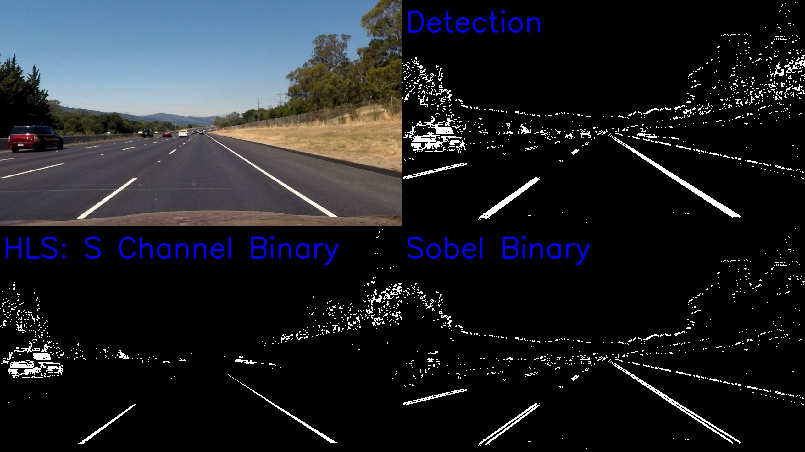

This figure is an example were the S channel is not able to properly detect the right line. 
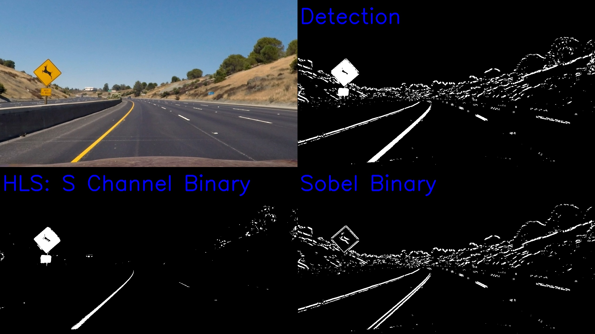

In this last example, the S channel detects the lines, but also shadow is added to the output. The gradient fails to detect the lines on the bright section. However, the overall result is still acceptable.
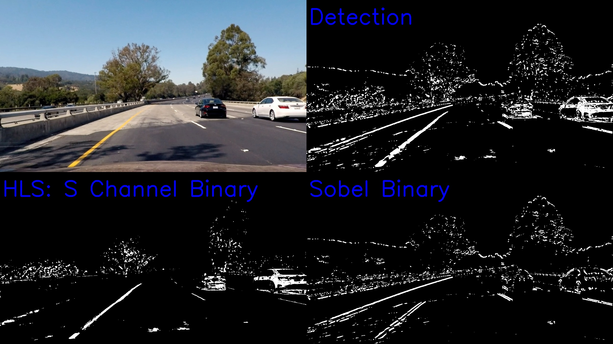

### 3. Describe how (and identify where in your code) you performed a perspective transform and provide an example of a transformed image.

The perspective transform is implemented on the `warp()` method of the `WarpMachine` class, located in `./src/calibration.py` file. The related section on the notebook is `4. Perspective Transform`.

The `WarpMachine.warp()` method uses the `cv2.warpPerspective` function and hardcoded source and destination points. The points are hardcoded in the same class, and were selected manually to perform well on the test images with straight lines: `test_images/straight_lines1.jpg` and `test_images/straight_lines2.jpg`. This resulted in the following source and destination points (clockwise from top-left corner):

| Source        | Destination   | 
|:-------------:|:-------------:| 
| 210, 720      | 320, 720      |
| 580, 460      | 320, 0        |
| 705, 460      | 960, 0        |
| 1110, 720     | 960, 720      |

Images below show how the perspective transform applies to an image were the lines are straight and one were the lines are curved. **Warped lane lines appear parallel in both images.**

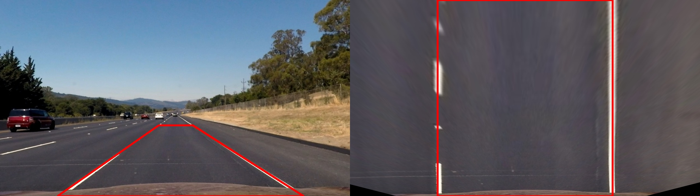
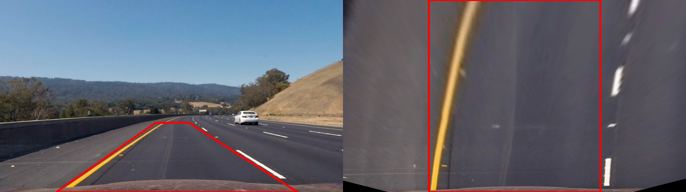

### 4. Describe how (and identify where in your code) you identified lane-line pixels and fit their positions with a polynomial?

The lane fitting methods are implemented in the `LaneFit` class, located in the file `./src/lane_fitting.py`. The related section on the notebook is `5-6. Lane Fitting, Curvature and Vehicle Position`.

The lane fitting implementation is copied from the one provided in the Advanced Computer Vision section of the udacity course. This approach is explained next.

Lane fitting is implemented in `LaneFit.fit_polynomial()` method. First, `LaneFit.find_lane_pixels()` method is used to:
- Create an histogram of the bottom half of the warped image.
- The histogram is divided into left and right sections, to look for peaks signaling a high confidence on the pixel where the line is located.
- Next, a stacked window approach is used to select all pixels which *belong* to each line.

Then, a second order polynomial is fit to the candidate pixels for each line.

Next images show 3 cases, on how the algorithm works over test images with: straight lines, curved lines, and shadow issues. In the last case, the line detection does not fit properly, as the detected edges contain noise from surrounding shadows.

### 5. Describe how (and identify where in your code) you calculated the radius of curvature of the lane and the position of the vehicle with respect to center.

The radius of curvature and vehicle position computation is implemented in the 
`LaneFit` class from the previous section. The related section on the notebook is `5-6. Lane Fitting, Curvature and Vehicle Position`.

The radius of curvature computation is implemented in method `LaneFit.get_curvature()`. Computation is based on equations provided in the course. The evaluation point is the bottom of the image. The following values were assumed:
- Real lane width: 3.7 m
- Real lane depth on warped image: 30 m
- Width of warped lane: 620 px  (this value is measured by hand on `output_images/warp_straight_lines2.jpg`)

Vehicle position is computed in method `LaneFit.get_vehicle_position()`. Camera is assumed to be exactly to the center of the car. Left and right polynomials are evaluated to the bottom pixel, to get the left and right line positions. Based on this, vehicle position is compared with the middle point between both lines.

Examples on both computed values is already displayed on examples of the previous section.

### 6. Provide an example image of your result plotted back down onto the road such that the lane area is identified clearly.

This is implemented in the `draw_overlay` function in file `./src/lane_tracker.py`. The related section on the notebook is `7-8. Overlay results in original image`.

Below are examples of the overlay on all test images.

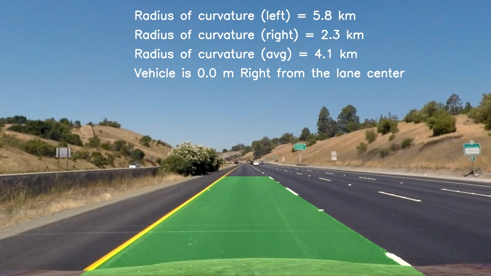
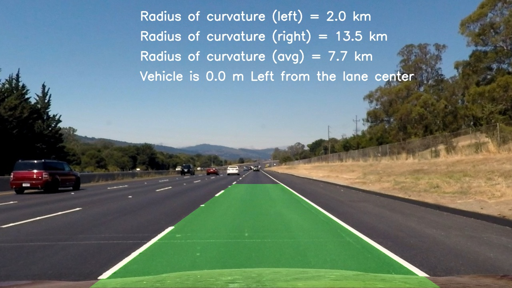
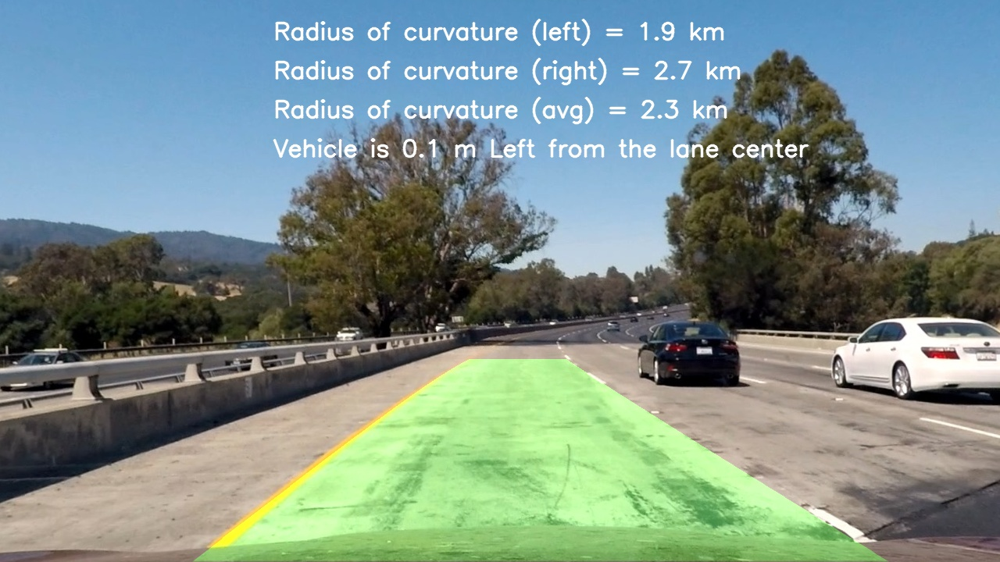
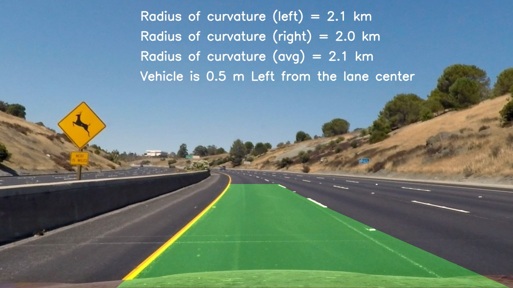
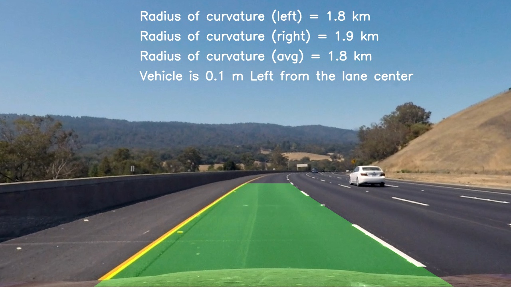
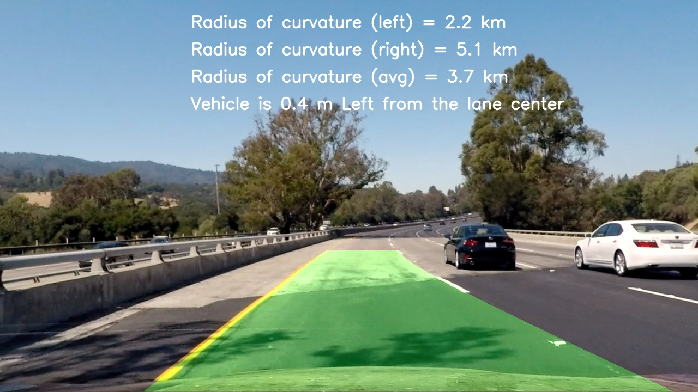
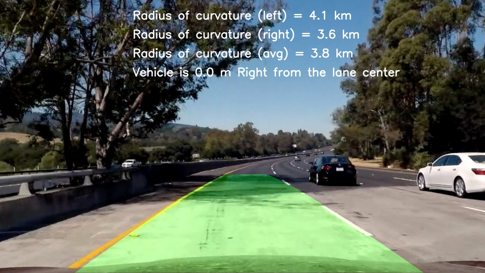
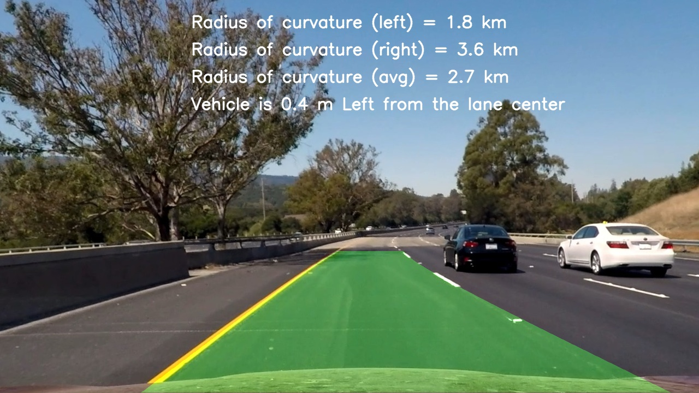

---

## Pipeline (video)

### 1. Provide a link to your final video output.  Your pipeline should perform reasonably well on the entire project video (wobbly lines are ok but no catastrophic failures that would cause the car to drive off the road!).

The video processing pipeline is implemented by the `LaneLinesTracker` class in file `./src/lane_tracker.py`. The related section on the notebook is `9. Project Video`.

Here's a [link to my video result](./output_videos/project_video_writeup.mp4)

---

## Discussion

### 1. Briefly discuss any problems / issues you faced in your implementation of this project.  Where will your pipeline likely fail?  What could you do to make it more robust?

Here I'll talk about the approach I took, what techniques I used, what worked and why, where the pipeline might fail and how I might improve it if I were going to pursue this project further.

**Shortcomings**
- The implemented pipeline is not using information from previous frames, so:
  - There is no low pass filter implemented for the polynomials.
  - There is no optimization based on polynomial confidence.
- The following assumptions are made:
  - Car is not doing a lane departure maneuver.
  - Daylight/Shadow contitions as in the sample images.
  - There is no car directly in front.
  - Lines are not occluded.
  - There is always 2 lane lines.

**Improvements**
- Edge detection can be improved to further remove noise. For instance, morphologic operations can help to remove lonely pixels.
- Healthy checks can be added over the detected lane polynomials, to discriminate based on curvature, position or on how parallel the lines are.

