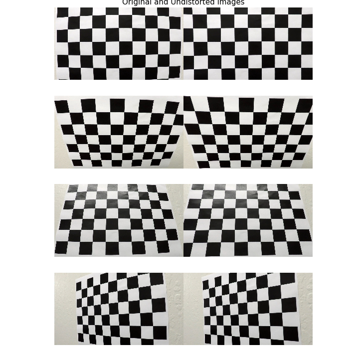

# Writeup

This document explains how each step of the pipeline was addressed. The explanation is focused on describing how each rubric point was implemented.

- [README:Project Goals](./README.md#project-goals)
- [README:Setting Up](./README.md#running-the-project)
- [Rubric Points](https://review.udacity.com/#!/rubrics/571/view)


[//]: # (Image References)

[image1]: ./examples/undistort_output.png "Undistorted"
[image2]: ./test_images/test1.jpg "Road Transformed"
[image3]: ./examples/binary_combo_example.jpg "Binary Example"
[image4]: ./examples/warped_straight_lines.jpg "Warp Example"
[image5]: ./examples/color_fit_lines.jpg "Fit Visual"
[image6]: ./examples/example_output.jpg "Output"
[video1]: ./project_video.mp4 "Video"

---

## IPython Notebook

Each section on the IPython notebook `main.ipynb` provides ready-to-run examples for each step of the pipeline, over single images and the full video. 

Please, make sure to run the first cell `IPython Notebook Configuration` when the notebook is loaded. 

All example sections are independent from each other, thus, they can be run in any order.

## Camera Calibration

### 1. Briefly state how you computed the camera matrix and distortion coefficients. Provide an example of a distortion corrected calibration image.

The camera calibration functions are provided by the `CameraModel` class, located in `./src/calibration.py` file. The related section on the notebook is `1. Camera calibration using chessboard images`.

First, the `CameraModel.calibrate()` method is used to:
1. Prepare the *object points* to be the (x, y, z) coordinates of the chessboard corners in the world. z is assumed to be 0.
2. Iterate through calibration images, looking for corners with `cv2.findChessboardCorners()` on gray images.
3. If corners are detected, then these are appended to the list of matches: 3D points (`self.objpoints`) and 2D corners (`self.imgpoints`).
4. A pickle file is created to keep a cache of all found 2D/3D points. Next time, if the cache is available, the calibration will be skipped.

Then, the `CameraModel.get_calibration()` method is used to retrieve the camera matrix and distortion coefficients required to correct undistorted images. These are computed by the `cv2.calibrateCamera()` function, based on the 2D/3D points found in the calibration step. As this computation only depends on the image size, the computation is cached for the last image (width, height) pair.

Finally, any given image can be *undistorted* using the `CameraModel.undistort()` method. This runs the `cv2.undistort()` function to correct the distortion on the image.

Next figure shows all chessboard images used for calibration, for which opencv was able to find corners, annotated with the `cv2.drawChessboardCorners()` function.


An example of the distortion correction can be found on the next section.


## Pipeline (single images)

### 1. Provide an example of a distortion-corrected image.

As noted above, the distortion correction is handled by the `CameraModel.undistort()` method. The related section on the notebook is `2. Distortion Correction`.

To demonstrate this step, I prefered using a selection of chessboard images, instead of the road images located in `test_images`. The correction effect is easier to appreciate on the grid provided by a chessboard, than in weak lanes present on road images. *If needed, distortion correction examples over road images can be found on the following sections, were the undistorted image is used as the baseline for every computation.*




### 2. Describe how (and identify where in your code) you used color transforms, gradients or other methods to create a thresholded binary image.  Provide an example of a binary image result.

I used a combination of color and gradient thresholds to generate a binary image. The filtering is provided by the `EdgeDetector` class in file `src/filtering.py`. The related section on the notebook is `3. Edge Detection`.

`EdgeDetector.detect()` method combines the HLS color space (S channel) and a group of sobel filters (x, y, magnitude, and direction) to produce a binary image indicating detected lane lines.

The S channel is able to detect lane lines on bright images, but strong shadows are also added to the binary. This channel is usually not able to detect small lane lines on the back of the image. The threshold was tuned to remove the car and also be effective for bright (`test_images/test1.jpg`) and dark (`test_images/test2.jpg`) images.

The sobel filter is composed of X, Y, magnitude, and direction components. These are computed based on the `cv2.Sobel` result over gray images. The kernel size and thresholds were tuned to remove as much noise as possible from the test images, without compromissing the lane detection. Particularlly, the direction gradient threshold was tunned to work effectivelly on the test road images. As grayscale images are used as input to the filter, Sobel performs poorly on bright images.

The next figure shows an example where the edge detection performs well enough. 


This figure is an example were the S channel is not able to properly detect the right line. 


In this last example, the S channel detects the lines, but also shadow is added to the output. The gradient fails to detect the lines on the bright section. However, the overall result is still acceptable.


### 3. Describe how (and identify where in your code) you performed a perspective transform and provide an example of a transformed image.

The code for my perspective transform includes a function called `warper()`, which appears in lines 1 through 8 in the file `example.py` (output_images/examples/example.py) (or, for example, in the 3rd code cell of the IPython notebook).  The `warper()` function takes as inputs an image (`img`), as well as source (`src`) and destination (`dst`) points.  I chose the hardcode the source and destination points in the following manner:

```python
src = np.float32(
    [[(img_size[0] / 2) - 55, img_size[1] / 2 + 100],
    [((img_size[0] / 6) - 10), img_size[1]],
    [(img_size[0] * 5 / 6) + 60, img_size[1]],
    [(img_size[0] / 2 + 55), img_size[1] / 2 + 100]])
dst = np.float32(
    [[(img_size[0] / 4), 0],
    [(img_size[0] / 4), img_size[1]],
    [(img_size[0] * 3 / 4), img_size[1]],
    [(img_size[0] * 3 / 4), 0]])
```

This resulted in the following source and destination points:

| Source        | Destination   | 
|:-------------:|:-------------:| 
| 585, 460      | 320, 0        | 
| 203, 720      | 320, 720      |
| 1127, 720     | 960, 720      |
| 695, 460      | 960, 0        |

I verified that my perspective transform was working as expected by drawing the `src` and `dst` points onto a test image and its warped counterpart to verify that the lines appear parallel in the warped image.

![alt text][image4]

### 4. Describe how (and identify where in your code) you identified lane-line pixels and fit their positions with a polynomial?

Then I did some other stuff and fit my lane lines with a 2nd order polynomial kinda like this:

![alt text][image5]

### 5. Describe how (and identify where in your code) you calculated the radius of curvature of the lane and the position of the vehicle with respect to center.

I did this in lines # through # in my code in `my_other_file.py`

### 6. Provide an example image of your result plotted back down onto the road such that the lane area is identified clearly.

I implemented this step in lines # through # in my code in `yet_another_file.py` in the function `map_lane()`.  Here is an example of my result on a test image:

![alt text][image6]

---

## Pipeline (video)

### 1. Provide a link to your final video output.  Your pipeline should perform reasonably well on the entire project video (wobbly lines are ok but no catastrophic failures that would cause the car to drive off the road!).

Here's a [link to my video result](./project_video.mp4)

---

## Discussion

### 1. Briefly discuss any problems / issues you faced in your implementation of this project.  Where will your pipeline likely fail?  What could you do to make it more robust?

Here I'll talk about the approach I took, what techniques I used, what worked and why, where the pipeline might fail and how I might improve it if I were going to pursue this project further.
  

# Perspective Transformation

- src,dest points are tuned using `test_images/straight_lines1.jpg` and `test_images/straight_lines2.jpg`.
- warp is validated using the remaining test images.
